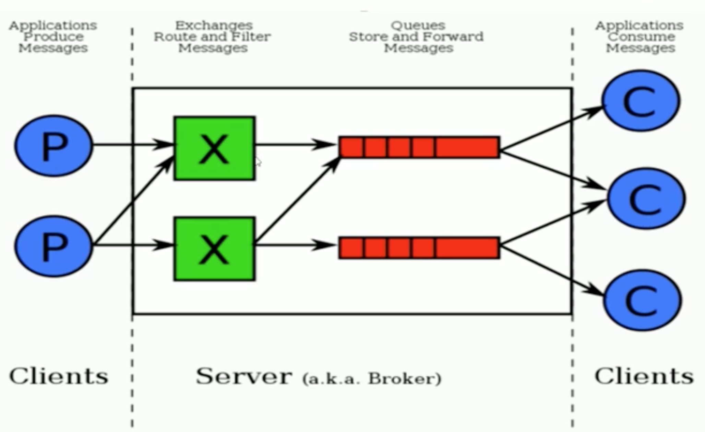

RabbitMQ
========

主流消息中间件
* RabbitMQ 性能和吞吐量并不是很优秀,开源,稳定性保障,API丰富，适用于对数据一致性,稳定性,可靠性要求很高的场景
* Kafka 性能优秀，事务不支持,稳定性并
* RocketMQ 各方面都优秀，缺点收费

#### 初识RabbitMQ
RabbitMQ:``是一个开源的消息代理和队列服务器，通过普通协议在完全不同的的应用间共享数据，基于AMQP协议 ``
* 优点: ``API丰富、集群模式丰富、表达式配置、HA模式
镜像队列模型``

##### AMQP核心概念
* Server:`又称Broker,接受客户端的连接,实现AMQP实体服务`
* Connection: `连接，应用程序与Broker的网络连接`
* Channel: `网络信道，几乎所有的操作都在Channel中进行的,channel是进行消息读写的通道.客户端可建立多个channel,每个channel代表一个会话任务。`
* Message: `消息，服务器与应用程序之间传送的数据,由Properties和Body组成。Properties可以对消息进行修饰,比如消息的优先级,延时等高级特性.Body则是消息体的内容。`
* Virtual host: `虚拟地址,用于进行逻辑隔离，最上层的消息路由。一个Virtual host里面有若干个Exchange和Queue,同一个Virtual Host里面不能有相同名称的Exchange或queue`
* Exchange: `交换机,接收消息,根据路由键转发消息到绑定的队列`
* Bingding: `Exchange与Queue之间的虚拟连接,bingding中可以包含routing key`
* Routing key: `一个路由规则,虚拟机可用它来确定如何路由一个特定消息`
* Queue: `也称为Message Queue,消息队列,保存消息并将它们转发给消费者`

RabbitMQ整体架构

[RabbitMQ安装](./document/install.md)
[Exchange交换机](./document/exchange.md)