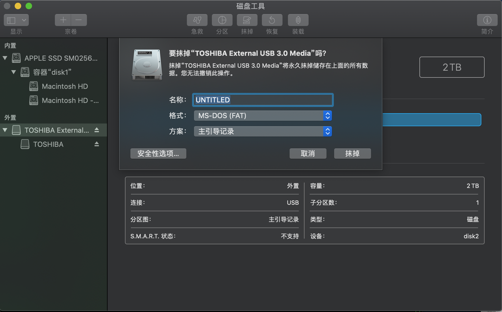
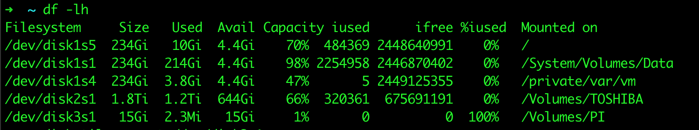
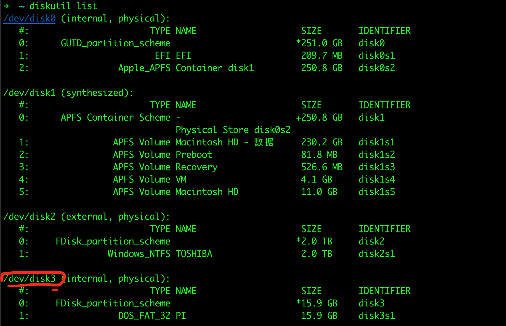

Raspberry pi 安装操作系统
=======================


### Mac下安装树莓派操作系统

#### 前期准备
* 读卡器
* SD卡
* 下载好的操作系统 
  + [树莓派官网下载地址](https://www.raspberrypi.org/downloads/)

#### 安装过程
###### 1. 格式化SD卡
   * 使用Mac自带的`磁盘管理工具`进行格式化即可

    ``` 启动台->其他->磁盘管理工具-->选择SD卡-->格式选择MS-DOS(FATA)-->抹掉 ```
  * 注意格式选择`MS-DOS(FAT)`


###### 2. 查看挂载的卷，主要查看SD所属卷
```sh
df -lh
```


这里要记住自己的SD卡的卷，我的是`/dev/disk3s1`,你们看到的可能不一样

###### 3. 分区卸载
```sh
diskutil unmount /dev/disk3s1 
```
这里的卷号`/dev/disk3s1`要替换成上一步看到的卷号

###### 4. 查看设备
```sh
diskutil list
```

这里需要查看并记住设备号，上图标注的`/dev/disk3`的`3`
###### 5. 向SD卡写入系统镜像
使用``dd``命令将系统镜像写入SD卡,`dd`命令参数如下:
* if 参数为`镜像文件`
* of 参数为`设备号名称` 这里要注意要使用上一步得到的设备号`3`与`rdisk`结合，即为`rdisk3`
```sh
sudo dd bs=4m if=2018-11-13-raspbian-stretch-full.img of=/dev/rdisk3
```
执行后需要等待几分钟到几十分钟不等，执行完毕会提示``records out``等提示字样
```bash
sudo dd bs=4m if=2018-11-13-raspbian-stretch-full.img of=/dev/rdisk3
Password:
1263+0 records in
1263+0 records out
5297405952 bytes transferred in 673.979788 secs (7859888 bytes/sec)
```
###### 6. 卸载设备
* 使用`diskutil unmountDisk`命令卸载设备
```bash
diskutil unmountDisk /dev/disk3
```
```bash
➜  ~ diskutil unmountDisk /dev/disk3
Unmount of all volumes on disk3 was successful
```
看到`successful`字样即卸载成功，最后就是拔下SD卡装到树莓派进行开机

#### 注意事项
* 正常运行的树莓派系统，红色电源灯是一直亮的，绿色的状态灯系统刚启动时是很快地一闪一闪的，系统启动完成后闪动频率会很低，不动的时候是基本不闪的

* 如果插入SD卡启动后，绿色灯一直亮,说明RaspberryPi无法识别系统